# Source Generators

---

# Wat is het?



- Een compiler plugin
- Genereert code tijdens het compileren
- Gebruikt de Roslyn compiler API

---

# Waarom?

- Runtime reflectie vervangen door compile-time generatie
  - AOT compilatie
- Meta-programmeren
- Externe API typed genereren
  - Swagger
- Transpile

---

# Spelregels

- De source generator moet .net standard 2.0 zijn
- Kan alleen source code toevoegen
- Project reference moet de output type hebben van Analyzer

```xml
<PropertyGroup>
    <TargetFramework>netstandard2.0</TargetFramework>
    <EnforceExtendedAnalyzerRules>true</EnforceExtendedAnalyzerRules>
</PropertyGroup>
```

```xml
<ItemGroup>
    <ProjectReference Include="<project>.csproj" OutputItemType="Analyzer" ReferenceOutputAssembly="false" />
</ItemGroup>
```

---

# .NET 8

---

# C# 12

## Primary constructors

```csharp
public class Person(string firstName, string lastName)
{
    public DateTime DateOfBirth { get; init; }

    public Person(string firstName, string lastName, DateTime dateOfBirth)
        : this(firstName, lastName)
    {
        DateOfBirth = dateOfBirth;
    }

    public override string ToString() => $"{firstName} {lastName}";
}
```

---

## Alias any type

```csharp
using FirstName = System.String;
using LastName = System.String;
using Person = (string FirstName, string LastName);

Person person = ("John", "Doe");
```

---

# Links

https://github.com/amis92/csharp-source-generators
https://sharplab.io/
https://github.com/rvhelden/SourceGenerators
